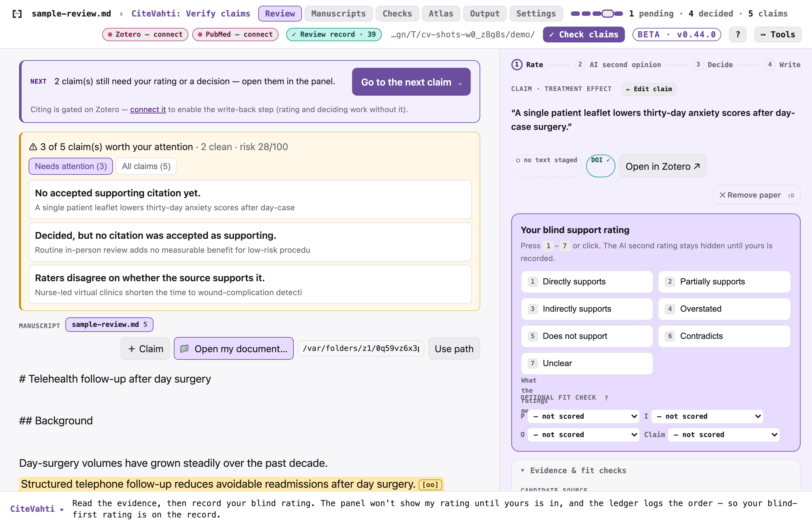
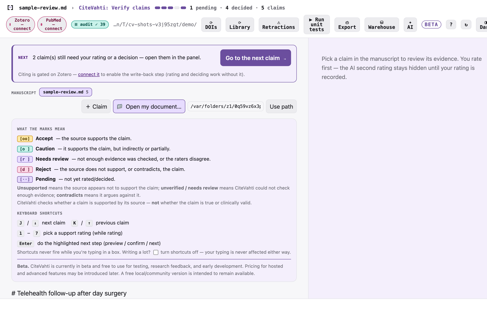
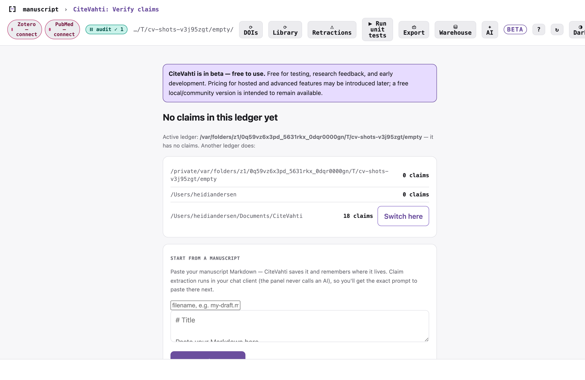

# CiteVahti

**Run unit tests on your manuscript. Check every claim before you cite it.**

> *A product of **Vahtian**.*

> **Status: v0.15.0 — the inline reviewer is the default, self-sufficient panel.**
> The ADR-0001 evidence-decision ledger is complete end to end (claim → candidate →
> blinded support rating → final decision → decision-gated, undoable Zotero write →
> de-identified warehouse), hash-chain audited, with 600+ offline tests. The loopback
> panel is now the **inline manuscript reviewer**: claims highlighted in place, an
> action-first **Rate → Reveal → Decide → Write** card, and enough built in to run
> the whole loop without the chat — find evidence (PubMed / OpenAlex / Semantic
> Scholar / your Zotero library), add claims, connect Zotero (paste or OAuth),
> backfill DOIs, scan for retractions, open a reference's PDF in Zotero, revise the
> `.md`, and read a per-claim audit trail. The AI second rating still comes only from
> your chat client over MCP. **`citevahti start`**
> launches the whole workspace at once — panel + browser + MCP server — and
> doubles as the one line in your chat client's MCP config. You drive the
> blinded review from **two co-primary surfaces (ADR-0007)**: a **chat client**
> (Claude Desktop / ChatGPT / Claude Code / Codex) via the MCP server and its
> **`run_claim_tests`** prompt, and a **loopback side panel** (`citevahti-panel`)
> that is the blind human-rating surface — the AI rating stays hidden until you
> rate. The VS Code inline review loop remains one adapter: claim spans by state,
> an evidence card that is now **rate-first** (the Accept/Caution/Review/Reject
> verdict is locked until you record your blind support rating), with **PICO
> fit-checks, a citation-fit score, and the supporting
> excerpt**, a **"Change reference"** PubMed search-and-link flow, an editor-mode
> Citation-Integrity Report, and an agent-proposes / human-accepts revision diff.
> Local-first and single-user. Your manuscript text and ratings stay on your machine
> and there is no telemetry; the only outbound calls are to the literature services it
> searches or checks — **PubMed (NCBI), OpenAlex, Semantic Scholar, and Crossref/doi.org**
> — and, if you connect it, **your Zotero**. Search queries and the titles/DOIs/PMIDs of
> references you look up are sent to those services. (PubMed is the primary search source;
> "PubMed-only" was an earlier, narrower scope.)

> **Positioning.** *CiteVahti is free and local-first for researchers, and Vahtian
> sells paid infrastructure to organizations that need auditable citation integrity
> at publication scale.* The open Apache-2.0 core never paywalls a researcher's
> ability to verify their own manuscript; the hosted layer (ADR-0003) serves
> organizations with citation-risk exposure — publishers, guideline groups,
> institutions, and medical-communications teams.

**CiteVahti runs unit tests on manuscript claims.** The manuscript is the code;
each scientific claim is a test case. It checks whether each claim is actually
supported by its cited or candidate evidence — using PubMed and Zotero, a
**blinded, human-first** rating workflow, and MCP-connected agents such as Codex or
Claude Code. The human rates support first; the AI second opinion stays hidden
until then; Zotero writes are previewed, confirmed, and undoable.

Three doors to the same product: *run unit tests on your manuscript* (agents /
technical researchers) · *check every claim before you cite it* (researchers) ·
*create an auditable claim-evidence trail* (journals / institutions). The core unit
is **not a paper and not a reference — it is a claim test.** VS Code is one adapter
and PyPI one install path; neither defines the product. CiteVahti's value is **not**
autonomous reviewing; it is a documented **human → AI → adjudication** workflow you
can report transparently in a methods section —
[docs/REPORTING.md](docs/REPORTING.md) has the fill-in-the-blanks methods
paragraph and the commands that produce its numbers. Single-user and local; literature
lookups use PubMed, OpenAlex, Semantic Scholar and Crossref (no telemetry).

> **The human or panel is always the decider. The AI is a blinded, advisory
> second rater only. AI values are advisory, never decisive, and never silently
> propagated.**

## Beta

**CiteVahti is currently in beta and free to use for testing, research feedback, and
early development. Pricing for hosted and advanced features may be introduced later.
A free local/community version is intended to remain available.**

## See it

The inline reviewer — your manuscript with claims highlighted in place, each reviewed
in an action-first **Rate → Reveal → Decide → Write** card. You rate first; the panel
withholds the AI's second rating until yours is recorded. Blinding is a panel-enforced
workflow, not a hard engine lock — but the ledger logs each rating's timestamp and the
rating **mode** (e.g. `human_first_ai_blind`) plus the comparison status (human-only /
AI-abstained / concordant / discordant), so the actual order is **auditable**, not assumed.



The legend (the header **?**) explains every mark and states plainly that CiteVahti
checks **citation support, not clinical truth**:



First run, on an empty ledger — paste a manuscript to get started, or connect your
sources. Claim extraction runs in your chat client, so the panel hands you the exact
prompt to use next:



> The screenshots use a small synthetic demo ledger. Regenerate it any time with
> `PYTHONPATH=src python3 docs/demo/build_demo_ledger.py .demo-ledger`, then preview it
> with the `cv-demo` launch config (`--root .demo-ledger`).

## Getting started: install, then pick a path

> **Using Claude Desktop and never open a terminal? You don't need one.**
> Download the **CiteVahti desktop extension (`citevahti.mcpb`)** from the
> [latest release](https://github.com/heidihelena/citevahti/releases/latest) and
> double-click it — Claude Desktop installs it, asks once for your CiteVahti
> folder, and the runtime is bundled (no Python, no pip). Then run the
> **`run_claim_tests`** prompt in chat; when it's time to rate, the assistant
> opens the rating panel in your browser for you. The `pip` route below is for
> terminal users and other chat clients. (Build it yourself:
> [desktop-extension/BUILD.md](desktop-extension/BUILD.md).)

```bash
pip install "citevahti[mcp]"     # the [mcp] extra adds the chat surface — keep both quotes
citevahti init                   # one-time: create the local .citevahti/ ledger
```

> `init` creates `.citevahti/` **in the current folder** — run it from your project
> folder, not your home directory. (Quote the install: the `[mcp]` brackets are a
> shell glob, so `pip install "citevahti[mcp]"` needs *both* quotes — a missing
> closing quote drops you into a `dquote>` prompt.)

Now choose **one** of two ways to drive the blinded review. Both use the same
ledger and the same loopback side panel; the human always rates first.

### Path A — chat-driven (recommended)

You don't run a server yourself — your **chat client launches it**. Add this one
line to the client's MCP config, pointing `--root` at your project folder:

```json
{ "mcpServers": { "citevahti": { "command": "citevahti", "args": ["start", "--root", "/path/to/project"] } } }
```

Then open the client (Claude Desktop / Claude Code / ChatGPT / Codex), run the
**`run_claim_tests`** prompt, and paste a paragraph — or attach the manuscript. The
side panel opens itself; you rate there first, the AI's rating stays hidden until
you do, and every Zotero write is previewed → confirmed → undoable.

> **Do not also run `citevahti start` in a terminal for this path.** That command
> is what the chat client spawns. Run by hand it takes over the terminal — it
> serves the MCP protocol on stdin, so **no prompt comes back** — and the panel
> stays **empty until a claim exists**. That looks broken but isn't: it's a server
> waiting for a client. Press `Ctrl-C` to get your shell back.

### Path B — hands-on (panel + CLI, no chat client)

Open **two terminals**. In the first, bring up the side panel — it keeps running
and occupies that terminal:

```bash
citevahti-panel --root /path/to/project    # http://127.0.0.1:8765, loopback only
```

In the **second** terminal, drive the loop on the CLI; the panel reflects each
change when you reload it:

```bash
citevahti claim-add --text "…" --type effectiveness
citevahti literature-search --query "…" --question-id q1
# … then rate and decide — full sequence in docs/QUICKSTART.md §4–7
```

That's the whole loop, either way. Everything below is depth on top of it.

**▶ New here? [`docs/QUICKSTART.md`](docs/QUICKSTART.md)** — the same path in full,
zero to your first claim-tested citation in ~10 minutes.

See [`docs/`](docs/) for the architecture, methods, safety invariants, CLI
reference, the reviewer checklist, and the [glossary](docs/GLOSSARY.md)
(claim vs statement, and the rest of the vocabulary).

## Direction: the citation-integrity ledger (ADR-0001)

As of 0.4.0 the product spine is **citation integrity** — *verify the claim
before you cite it.* The **claim** is the first-class object, and the ledger is:

```
manuscript claim → candidate papers → blinded claim-support rating
  → human-owned final decision → decision-gated, undoable Zotero write → audit
```

An **audited** Zotero write happens only as the terminal step of that chain
(one claim · one paper · one final `accept` decision · provenance · transaction ·
audit · undo) — never silently, never for a paper that doesn't support the claim.
See [`docs/adr/0001-citation-integrity-architecture.md`](docs/adr/0001-citation-integrity-architecture.md)
for the decision and the local-first build sequence (**steps 1–6 complete**), and
[`docs/adr/0002-ui-delivery-and-review-layer.md`](docs/adr/0002-ui-delivery-and-review-layer.md)
for the inline `[oo/o/r/d]` review-layer UI direction.

## What CiteVahti guarantees (read first)

- **Zotero local API is read-only / GET-only.** CiteVahti never writes to Zotero
  through `/api/`; all reads go through it and nothing is mutated.
- **Better BibTeX is the citation engine.** Citekey resolution and export run
  through BBT's JSON-RPC; CiteVahti never invents citekeys.
- **`.citevahti/` is the durable state layer.** Config, frames, the evidence map,
  ratings, intake, snapshots, PRISMA ledgers, exports, and a hash-chained audit
  log all live there — independent of Zotero.
- **Literature lookups are search-only and never decide inclusion.** PubMed
  (NCBI E-utilities) is the primary search provider, with OpenAlex, Semantic
  Scholar, and Crossref alongside it — all behind a pluggable interface.
- **The AI is a blinded, advisory second rater only.** It never sees the human
  value, never decides, and never sets the recorded value.
- **The human/panel is always the decider.**
- **AI values never become `final_value` automatically.** A discordance is
  resolved only by a human/panel adjudication with a rationale.
- **Write-back is optional, dry-run-first, token-confirmed, and never silently
  falls back** from the local add-on to the Web API.
- **All state mutations are audit-logged** in a tamper-evident, hash-chained
  `audit_log.jsonl`.
- **Unit tests use fake seams and pass fully offline** — no live Zotero, BBT,
  PubMed, or network writes are required to run the suite.

## Scope: what CiteVahti can and cannot auto-check

CiteVahti today is built for claims checked against **indexed literature**
(PubMed, OpenAlex, Semantic Scholar, Crossref) — its sweet spot is biomedical
and quantitative writing. Books, book chapters, grey literature, policy
reports, and non-indexed or non-English sources are often **not
auto-searchable**: a claim citing them is not wrong, it is out of the tool's
indexed scope. Mark such claims with
`citevahti claim-untestable <claim-id> --reason "1992 monograph, not indexed"`
and the report shows them as **`[u]` untestable (out of indexed scope)** —
verify them against the source text directly — instead of letting a correct
citation look like a failing one. The PICO fit-checks are likewise optional:
they help where a claim has a population/intervention/outcome shape and can be
skipped where it doesn't.

## Probe, not proof

The expected runtime (Zotero 9.x local API on macOS, Better BibTeX) is **not**
assumed. On startup CiteVahti **probes and caches** each capability with a
remediation string, and reports a capability available *only after a successful
probe*. The three version types are kept strictly distinct and never confused:

- **Zotero app version** — from the `x-zotero-version` header (e.g. `9.0.4`).
- **Zotero local-API schema version** — `zotero-schema-version` (e.g. `42`);
  **never** surfaced as the app version.
- **Better BibTeX add-on version** — from BBT's `api.ready` response (e.g.
  `9.0.27`); read live, never hardcoded, never taken from the app-version header.

`localhost` is used uniformly (the `/api/` path checks `Host: localhost:23119`).
If a backend is absent, the relevant tools degrade honestly with a remediation
string rather than failing silently or fabricating data.

```bash
citevahti init          # create the .citevahti/ state layer
citevahti probe         # probe Zotero /api/, BBT api.ready, CAYW probe=1
citevahti verify-audit  # check the hash-chained audit log
# (the legacy `citevahti` command still works as an alias)
```

## Architecture (three stores + PubMed)

1. **Zotero local API** (read-only) — items / attachments / collections / full
   text / annotations.
2. **Better BibTeX** (JSON-RPC + CAYW) — stable citekeys, citation insertion, export.
3. **PubMed via NCBI E-utilities** — the only online search provider; search-only.
4. **`.citevahti/` local state** — durable provenance layer with a hash-chained audit log.

Details: [`docs/ARCHITECTURE.md`](docs/ARCHITECTURE.md).

## The blinded dual-rating method

Human commits **blind** → AI rates **blind** to the human value (may abstain) →
the system **compares** (`concordant→accepted` / `discordant→needs_adjudication`
/ `ai_abstained` / `human_only`) → a human/panel **adjudicates** every
discordance → the recorded `final_value` is always human/panel-sourced.

This maps onto transparent AI-in-evidence-synthesis reporting (PRISMA 2020 /
PRISMA-trAIce; RAISE; the Cochrane/Campbell/JBI/CEE position on human oversight).
CiteVahti **records and reports** what was done; it **does not claim compliance
with, or endorsement by, any guideline.** Full description:
[`docs/METHODS.md`](docs/METHODS.md).

### Schemes (recorded, not computed)

- **Primary: GRADE certainty** at the outcome / body-of-evidence level —
  `High | Moderate | Low | Very Low`.
- **Secondary: RoB 2 / ROBINS-I** at the study (or study × outcome) level.
  ROBINS-I *No information* is missing-like, not an ordinal point.

CiteVahti **records** human-chosen values and the AI's blind second rating; it
**never computes GRADE and never runs RoB signalling questions.**

## Scope boundary

**Owns:** citation integrity, citekey/export, annotation provenance, PubMed
staging, assistive extraction, claim support, human-chosen quality/GRADE
recording, blinded AI second-rating + adjudication records, multi-rater agreement
reporting, evidence-map exports, snapshots, corpus diffs, retraction staleness,
PRISMA tallying, agreement/provenance reporting, audit, guarded write-back.

**Does not:** design search strategies, decide inclusions, replace screening
platforms, run RoB / ROBINS-I signalling questions, compute GRADE, perform
meta-analysis, generate recommendations, or author the review.

## Setup

```bash
# with uv
uv venv && uv pip install -e ".[dev]"
# or pipx for the CLI
pipx install .
pytest                 # the full suite (600+ tests), fully offline
bash scripts/final_smoke.sh   # pytest + probe + verify-audit (no writes)

# install the VS Code inline review extension from the Marketplace
code --install-extension heidihelena.citevahti-vscode
```

In VS Code you can also search the Extensions view for **CiteVahti (Vahtian)**
and click Install.

Prefer not to use the Marketplace? Build it yourself or grab the prebuilt `.vsix`:

```bash
cd vscode-extension && npm install && npm run package
code --install-extension citevahti-vscode-0.15.0.vsix
```

The prebuilt `.vsix` is attached to the
[latest release](https://github.com/heidihelena/citevahti/releases/latest);
run `code --install-extension citevahti-vscode-0.15.0.vsix` (or, in VS Code,
Extensions → `…` → **Install from VSIX…**).

Config via environment (`NCBI_EMAIL`, `NCBI_API_KEY`) + `.citevahti/config.json`.
CLI reference: [`docs/CLI.md`](docs/CLI.md). Full walk-through (zero → first
claim-tested citation): [`docs/QUICKSTART.md`](docs/QUICKSTART.md).

## Try it (what to do)

A five-minute path through the inline review layer. Full version with copy-paste
commands: [`docs/QUICKSTART.md`](docs/QUICKSTART.md).

1. **Install + build the extension** — the two blocks under [Setup](#setup)
   (`pip install -e`, then `npm run package` + `code --install-extension`). In
   VS Code, set `citevahti.cliPath` to your `citevahti` binary
   (e.g. `.venv/bin/citevahti`).
2. **Create a project + connect Zotero (optional, for write-back):**
   ```bash
   citevahti init
   citevahti onboard --ncbi-email you@uni.edu --no-zotero-key --skip-validate
   citevahti connect-zotero          # one-paste key flow; stored in your OS keychain
   ```
3. **Add a claim from your manuscript, find evidence, link it:**
   ```bash
   citevahti claim-add --text "Low-dose CT screening reduces lung-cancer mortality in high-risk populations." --type effectiveness
   citevahti literature-search --query "low-dose CT lung cancer screening mortality randomized" --question-id q1
   citevahti claim-link-candidates --claim-id <CLAIM_ID> --intake-batch-id <BATCH_ID>
   ```
4. **Review in VS Code:** open the manuscript, run **Command Palette →
   “CiteVahti: Verify claims.”** Claims are highlighted by state. Expand one,
   focus a candidate, and:
   - read the **evidence card** — supporting **excerpt**, **PICO fit-checks**
     (Population / Intervention / Outcome / Claim), and the **citation-fit score**
     (`n/8`, Strong / Moderate / Weak);
   - press the verdict — **`o o` accept**, `o` caution, `r` review, `d` reject.
     *(The panel hides the AI's rating until you rate; the ledger logs the order, so blinding is auditable.)*
   - on a weak claim, click **“⇄ Change reference…”** to search PubMed and add a
     better-fitting paper as a new candidate;
   - on an accepted candidate, click **“✓ Add to Zotero”** → preview → confirm →
     done, with **Undo**.

> Nothing is written to Zotero, and no claim text is edited, without an explicit
> confirm — every write is previewed, audited, and undoable.

## What to test

To verify a checkout behaves as documented:

```bash
pytest                          # full suite (600+ tests), offline — no Zotero/BBT/PubMed/network needed
bash scripts/final_smoke.sh     # pytest + probe + verify-audit, no writes
cd vscode-extension && npm install && npm run compile && npm run package   # extension builds → .vsix
```

Then a manual acceptance pass in VS Code (after **CiteVahti: Verify claims**):

- [ ] **Highlighting** — each claim is decorated by its state (`oo / o / r / d / u`),
      and the overview ruler shows the same colors.
- [ ] **Blinding** — before you rate, the card shows the AI support as
      *hidden*; it appears only after you commit your own rating.
- [ ] **Evidence card** — a rated candidate shows the excerpt, the four
      PICO fit-checks, and a citation-fit score (`n/8`).
- [ ] **Keyboard verdicts** — `o o` records `accept`, `o` caution, `r` review,
      `d` reject; each prompts for an audit reason.
- [ ] **Change reference** — “⇄ Change reference…” runs a PubMed search, lets you
      pick results, and the new candidates appear on the claim after refresh.
- [ ] **Write-back** — “✓ Add to Zotero” previews the change and asks to confirm;
      after committing, the **Undo** action removes it again.

Safety invariants are also asserted by the suite —
[`docs/SAFETY_INVARIANTS.md`](docs/SAFETY_INVARIANTS.md) and
[`docs/REVIEW_CHECKLIST.md`](docs/REVIEW_CHECKLIST.md).

## Build status

Built in nine reviewed steps; see [`CHANGELOG.md`](CHANGELOG.md). Every step is a
separate branch with its own commit. Safety invariants are enforced in code and
asserted by the test suite — see [`docs/SAFETY_INVARIANTS.md`](docs/SAFETY_INVARIANTS.md)
and [`docs/REVIEW_CHECKLIST.md`](docs/REVIEW_CHECKLIST.md).

## License

Apache License 2.0 — see [LICENSE](LICENSE) and [NOTICE](NOTICE). The library, CLI,
MCP agent surface, and VS Code extension are all Apache-2.0.
