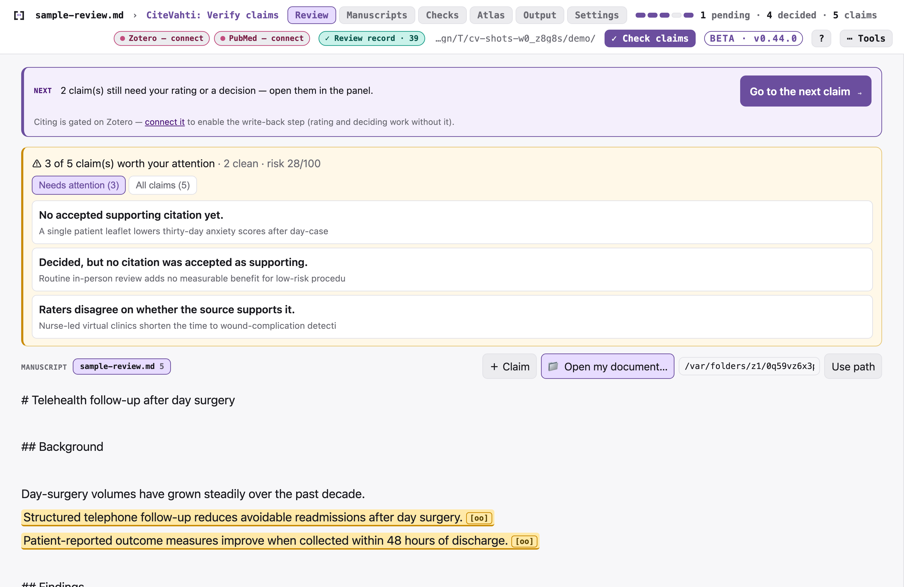
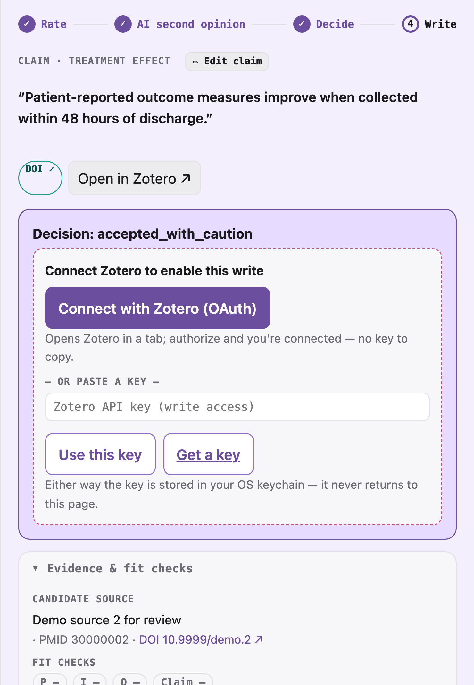
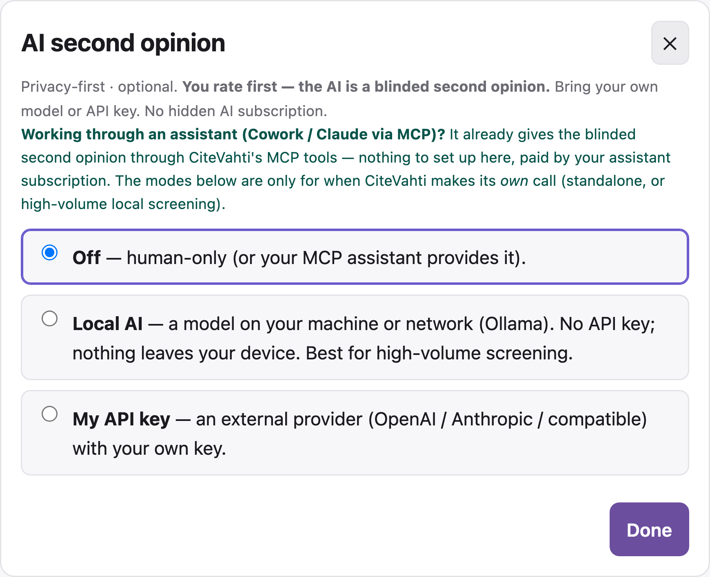
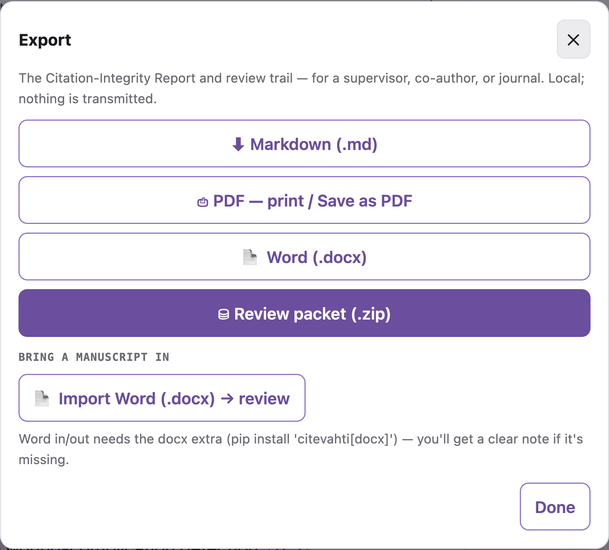

# CiteVahti

**Run unit tests on your manuscript citations.**

CiteVahti checks whether each manuscript claim is actually supported by the paper
cited for it. You rate first, AI gives a blinded second opinion, and every decision is
recorded in an auditable local ledger.


> **Free beta.** CiteVahti is free to use while in beta. Local-first: your manuscript
> never leaves your device unless you choose to use an external AI model.

## Why use it?

- Catch citations that do not support the sentence they are attached to.
- Review claim by claim, inside the manuscript.
- Keep the human decision primary.
- Use optional AI without letting it silently decide.
- Write to Zotero only after preview and confirmation.
- Export a citation-integrity report for methods, review, or audit.

## Start here

### No terminal — Claude Desktop

Download `citevahti.mcpb` from the [latest release](https://github.com/heidihelena/citevahti/releases),
double-click it, choose a CiteVahti folder, then ask:

> Run claim tests on my manuscript using CiteVahti.

### Terminal

```bash
pip install "citevahti[mcp]"
citevahti run
```

CiteVahti opens the local review panel at `127.0.0.1`. It tells you the one next thing
to do — no command to remember.



### Update to a new version

For a clean update — uninstall, clear the cached wheel, then reinstall:

```bash
pip uninstall -y citevahti
pip cache remove citevahti
pip install "citevahti[mcp]"
pip show citevahti          # confirm the new version
```

Or in one line: `pip install --no-cache-dir --upgrade "citevahti[mcp]"`.

Your review data in `.citevahti/` is **not** touched by this — updating only replaces the
program. On Claude Desktop, download the newest `citevahti.mcpb` and double-click it to
replace the old extension.

## The workflow

1. Paste or open a manuscript.
2. Extract claim-like statements.
3. Link candidate evidence.
4. Rate support yourself.
5. Reveal the AI second opinion.
6. Decide: accept, caution, review, or reject.
7. Preview Zotero or manuscript changes.
8. Export the report.

The card walks a visible **Rate → Reveal → Decide → Write** stepper, one claim at a time,
so you always know where you are and what comes next.



Starting from nothing is just as guided: paste a paragraph and CiteVahti takes it from
there — no account, nothing uploaded.


## Privacy and safety

CiteVahti is local-first.

- Manuscripts and ratings stay in `.citevahti/` on your machine.
- The panel runs on loopback (`127.0.0.1`) only.
- Zotero writes require preview and confirmation.
- AI is optional and blinded.
- Local AI and bring-your-own API key modes are supported.
- No telemetry.

## What AI does

AI is a **second rater, not the judge.** You always rate first. CiteVahti can then compare
your rating with an optional AI rating from:

- your MCP assistant,
- a local model such as Ollama,
- or your own OpenAI/Anthropic-compatible API key.

The AI rating stays hidden until your rating is in, and the final decision is always
yours. There is no hidden AI subscription — pick the mode you want, or leave AI off.



### Run AI on your own machine (free, private)

Local mode runs the model on your computer — no API key, nothing leaves your device.

1. Install [Ollama](https://ollama.com/download) (macOS: `brew install ollama`).
2. Pull a model — `qwen2.5` is recommended for claim checking:
   ```bash
   ollama pull qwen2.5
   ```
   (Pick a smaller tag if your machine is tight on memory, e.g. `ollama pull qwen2.5:3b`.)
3. In the panel, open **✦ AI → Local AI**. CiteVahti detects the installed model and
   pins its exact version so the rating stays auditable.

To update later, re-pull the same name (`ollama pull qwen2.5`) for the newest build.

## What gets written

CiteVahti never silently changes Zotero or your manuscript. Every write follows the same
gate:

```
Preview → Confirm → Audit → Undo available
```

## What you can export

Generate a citation-integrity report (Markdown, print-ready HTML, Word, or a review-packet
`.zip`) for a methods section, a co-author, a supervisor, or a journal. The packet even
includes an auto-filled methods paragraph with your review's actual numbers.



## What it does and does not check

CiteVahti checks **citation support, not the truth of the underlying claims.** It tests
whether the cited paper supports the sentence — it does not certify that every claim in
the manuscript was entered, and it is not a clinical or scientific oracle. Blinding is a
panel-enforced workflow (the AI value is withheld until you rate), recorded in the ledger
with timestamps and comparison status so the order is auditable, not assumed.

## Documentation

- [Quickstart](docs/QUICKSTART.md)
- [CLI reference](docs/CLI.md)
- [Safety invariants](docs/SAFETY_INVARIANTS.md)
- [Architecture](docs/ARCHITECTURE.md)
- [Reporting in your methods section](docs/REPORTING.md)
- [Status & capabilities](docs/STATUS.md)
- [Contributor privacy](docs/CONTRIBUTOR_PRIVACY.md)

## Companion: FullVahti

A Zotero plugin that finds free, legal open-access PDFs for your references and writes
CiteVahti's verified results back as tags — so the citation check and the full text live
in one place.

## License

Apache License 2.0 — see [LICENSE](LICENSE) and [NOTICE](NOTICE).
